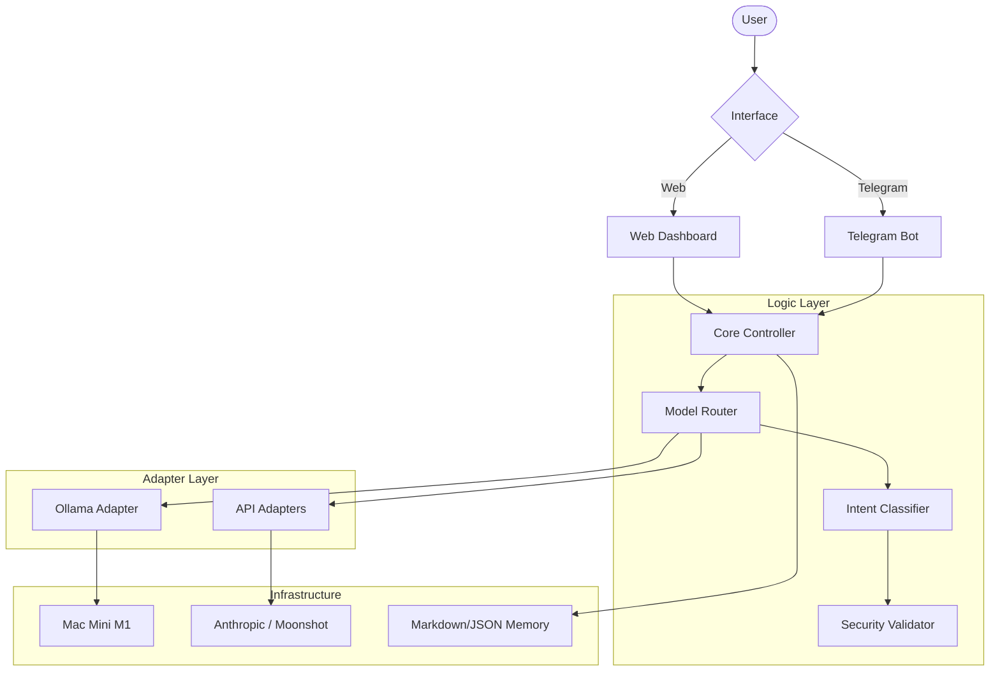

# Architecture Overview

This document describes the technical structure of **MyAgent**, focusing on the intelligent routing and security infrastructure.

## System Architecture



## Core Components

### 1. Model Router (`core/router.py`)
The "Brain" of the system. It analyzes user input to determine the most cost-effective and secure way to handle a request.
- **Intent-Based Routing**: Categorizes requests into `SPEED`, `QUALITY`, `PRIVATE`, `NSFW`, `CODING`, or `FINANCE`.
- **Model Selection**: 
  - **Private/NSFW**: Always routed to local Ollama models (e.g., `hermes-roleplay`).
  - **Coding**: Routed to `codellama` or Anthropic depending on complexity.
  - **General Knowledge**: Usually routed to Anthropic or Moonshot for precision.

### 2. Security Validator (`core/security.py`)
Implements the "Trust but Verify" model.
- **Input Filtering**: Checks for prompt injections before sending to remote models.
- **Output Inspection**: A local "Judge" model reviews responses for PII (Personally Identifiable Information) leaks or malicious code.
- **Heuristic Layer**: Rapid regex-based checks for shell commands (e.g., `rm -rf`, `curl`).

### 3. Memory System (`core/memory.py`)
A privacy-first long-term memory system.
- **Markdown-Based**: Stores user preferences, project history, and context in human-readable Markdown files.
- **Local Only**: Memory is never synced to the cloud, ensuring full data sovereignty.

### 4. Adapter Pattern (`core/adapters_*.py`)
Unified interface for interacting with different AI providers. This allows the system to swap models (e.g., switching from OpenAI to Anthropic) with zero changes to core logic.

## Technical Stack
- **Backend**: Python 3.10+ (FastAPI)
- **Frontend**: Next.js 14+ (TypeScript)
- **AI Runtime**: 
  - **Local**: Ollama (Llama 3, Mistral, CodeLlama)
  - **Cloud**: Anthropic (Claude), Moonshot (Kimi)
- **Messaging**: Telegram Bot API
```
